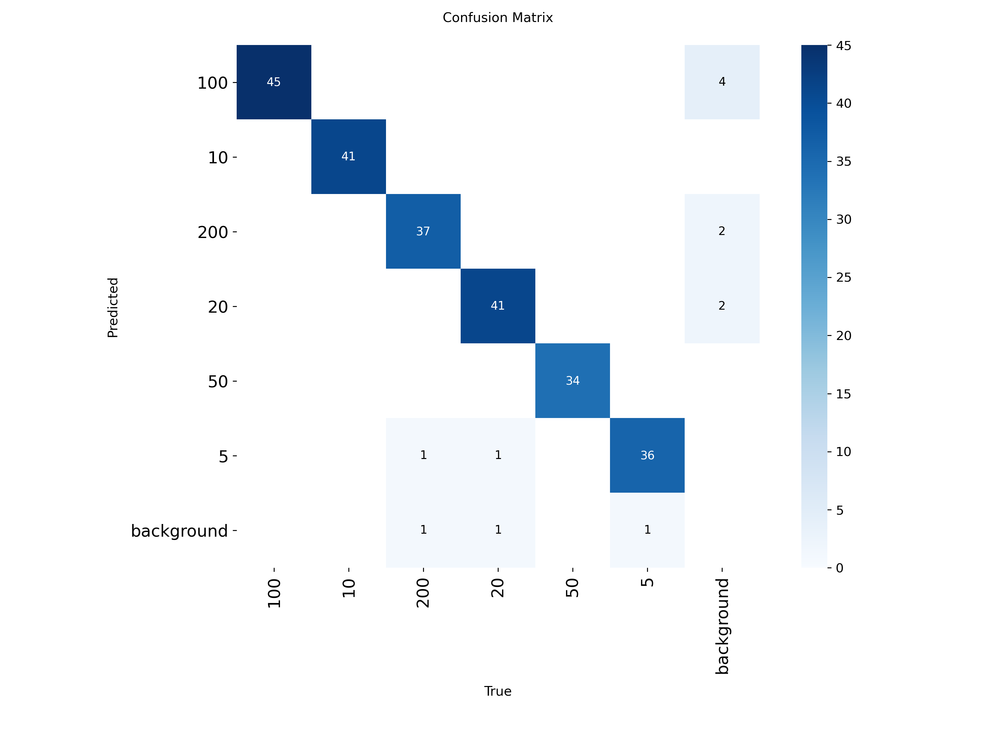
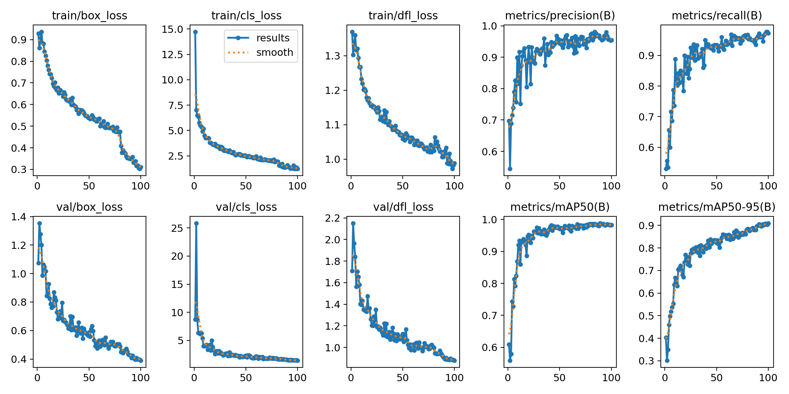
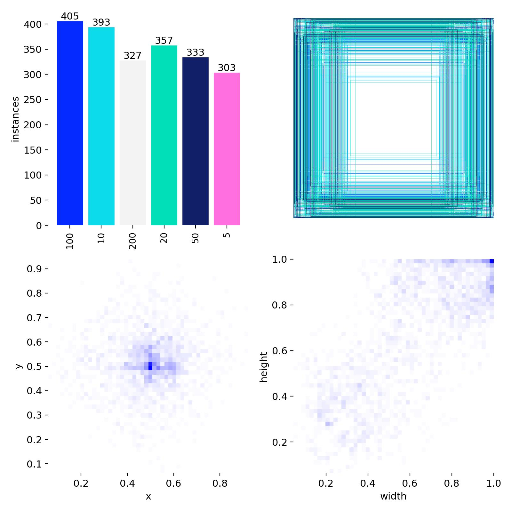
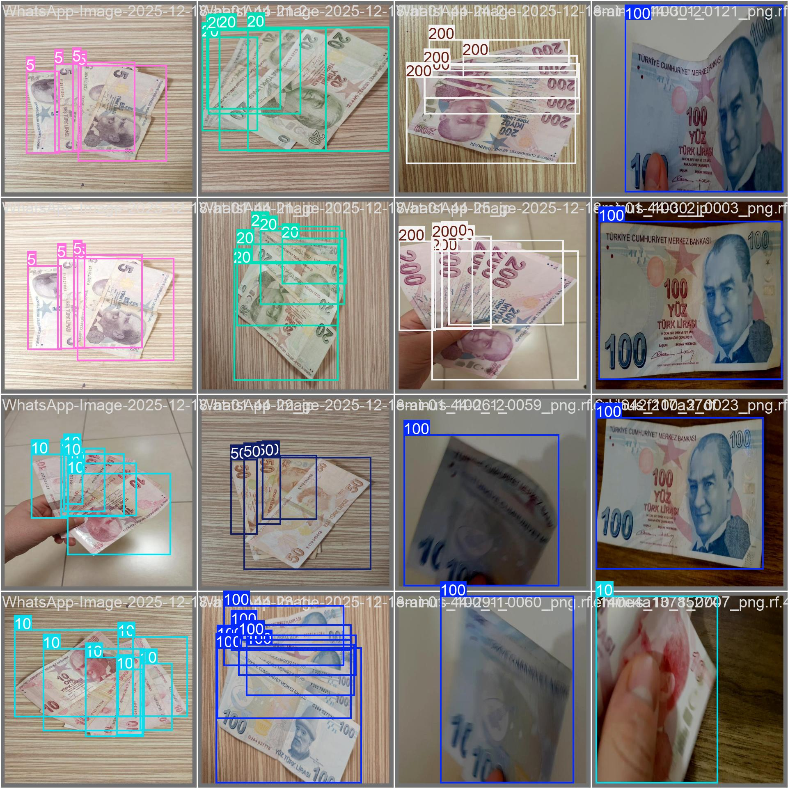

Para Tanıma ve Sayma Projesi (Money Detection)

Bu proje, YOLOv8 modeli kullanılarak Türk Lirası banknotlarını tanıyan ve Flutter ile geliştirilen bir mobil uygulama projesidir.

Model ve Analiz Sonuçları
Projenin analiz aşamaları ve model başarı metrikleri aşağıdadır:

| Karmaşıklık Matrisi | Eğitim Sonuçları |
| :---: | :---: |
|  |  |

| Veri Seti Etiketleri | Örnek Tespit |
| :---: | :---: |
|  |  |

## Kullanılan Teknolojiler
* **Yapay Zeka:** YOLOv8 (Object Detection)
* **Mobil:** Flutter & Dart
* **Analiz:** Python (Jupyter Notebook - .ipynb)
